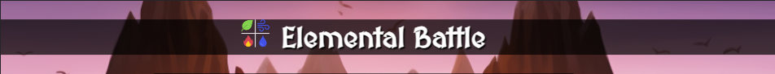
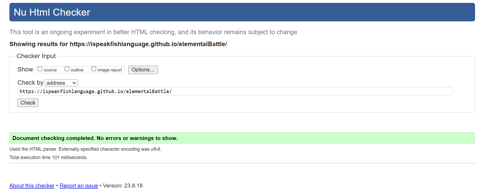
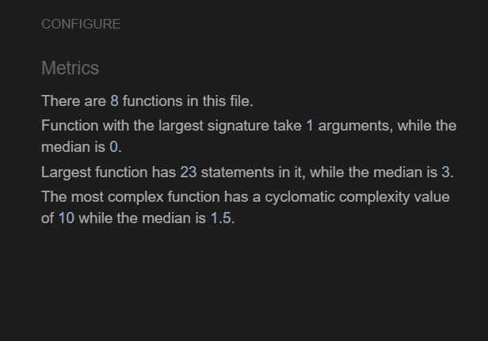

Welcome,

# Elemental Battle
Elemental Battle is a simple JavaScript-based game inspired by the concept of elemental interactions. Players choose an element, and the computer selects one as well. The game determines the winner based on the rules governing the interactions between the elements.
This is my second portfolio project for Code Institute's full-stack developing Bootcamp and I used HTML, CSS and JavaScript combined for the first time

[Here is a live demo of the website](https://ispeakfishlanguage.github.io/elementalBattle/)


---

## CONTENTS
* [Game information](#game-information)
    * [Game description](#game-description)
    * [Game Rules](#game-rules)
    * [Game Mechanics](#game-mechanics)

* [User Experience](#user-experience-ux)
  * [User Stories](#user-stories)

* [Design](#design)
  * [Color Scheme](#colour-scheme)
  * [Typography](#typography)
  * [Imagery](#imagery)
  * [Wireframes](#wireframes)

* [Features](#features)
  * [General Features on Each Page](#general-features-on-each-page)
  * [Future Implementations](#future-implementations)
  * [Accessibility](#accessibility)

* [Technologies Used](#technologies-used)
  * [Languages Used](#languages-used)
  * [Frameworks, Libraries & Programs Used](#frameworks-libraries--programs-used)

* [Deployment & Local Development](#deployment--local-development)
  * [Deployment](#deployment)
  * [Local Development](#local-development)
    * [How to Clone](#how-to-clone)

* [Testing](#testing)
  *[Testing the buttons](#testing-the-elements-of-the-webpage)

* [Credits](#credits)
  * [Code Used](#code-used)
  * [Content](#content)
  * [Media](#media)
  * [Acknowledgments](#acknowledgments)

---

## Game Information

#### Game description

The player chooses an element, and the computer randomly selects an element. The game determines the winner based on the interactions between the elements.
Elements:
* Fire
* Water
* Earth
* Air
* Lightning

#### Game Rules

Element Interactions:
* Fire beats Earth and Air.
* Water extinguishes Fire and defeats Lightning.
* Earth absorbs Water and Air.
* Air defeats Earth and Lightning.
* Lightning defeats Water and Air.

#### Game Mechanics

Objective: The objective of the game is to win as many rounds as possible against the computer opponent. 

Game Flow:

* Start Screen: The game starts with a start screen that allows the player to choose the number of rounds they want to play. The player clicks on one of the number buttons to select the number of rounds.

* Gameplay Screen: After selecting the number of rounds, the game transitions to the gameplay screen. Here, the player can see the current round number, the player's score, the computer's score, and the result of the previous round (initially empty).

* Player's Choice: The player makes a choice by clicking one of the choice buttons (e.g., "fire," "water," "earth," "air," "lightning"). This represents the player's move for the current round.

* Computer's Choice: The computer randomly selects one of the elements (choices) available in the game.

* Determining the Winner: The game determines the winner of the round based on the rules defined in the elements object. Each element can beat or be beaten by specific other elements. For example, "fire" beats "earth" and "air." The code checks if the player's choice beats the computer's choice or vice versa to determine the round winner. If neither beats the other, it's a tie.

* Updating Scores: The game updates the player's and computer's scores based on the outcome of the round. Winning a round increases the respective score by 1 point.

* Displaying Results: The result of the round is displayed on the screen, indicating whether the player won, lost, or tied the round. It also shows what choice the computer made.

* Round Progression: The game increments the round number and updates the displayed round number.

* Game Over: The game checks if the current round number is equal to or greater than the total number of rounds selected at the beginning. If so, the game is over. It displays an alert message indicating whether the player won, lost, or tied the game and restarts the game.

* Restarting the Game Manually: The player can also restart the game by clicking a "Restart" button, which takes them back to the start screen.

In summary, the game is based on a series of rounds where the player and the computer make choices, and the winner of each round is determined by the predefined rules. The player's objective is to win as many rounds as possible within the specified number of rounds.

## User Experience (UX)

#### Why This Website Exists

I made this website to to showcase my current skills while providing a fun and easy game to pass time. In this game the user plays against the computer and it's based on a rock, paper, scissor game with extra elements. It provides a simple and easy interaction with the user, game customization prompting the user to select how many rounds to play, and ensures users have a clear understanding of the game rules at all times with the rules button.

#### User Stories 

Starting the Game: User sees a start screen with title and is prompted to select how many rounds of the game will be played. Clicking any number options opens the game content. Clicking the "Rules" button opens a screen above it with the rules of the game.

Choosing a Move: User sees Fire, Water, Air, Earth, Lightning images for selection. User needs to pick an one. Clicking an icon shows win, loss, or tie outcome.

Viewing Score: Current score displayed for the player and the computer, round number is also shown. Option to restart the game is available.

Viewing Game Rules: Button to view game rules present. Clicking on the button shows the rules screen over the button. Clicking the button again hides the rules screen.

Footer & Links: Footer shows creator's name and GitHub profile link.

Accessibility: Alt text for all images ensured. Clear labels for all interactive items.

## Design

### Color Scheme

The main colors used in the website are:

* whitesmoke:          Used for text color in the body and other elements.
* darkgoldenrod:       Used for link color on hover.
* black:               Used as the background color for the footer and with 70% opacity as the background color for the start, game, and rules screens.
* #445361:             Used as a background color for the round selection, restart and rules buttons.


### Typography

I used googles font MedievalSharp as the main font with Cursive as backup in case the 'MedievalSharp' font is not available on the user's system or if there are issues loading it from Google Fonts.

[Google Fonts](https://fonts.google.com/specimen/MedievalSharp)


### Imagery

* The background image was generated by [Midjourney](https://www.midjourney.com/app/jobs/aeb9a5f9-9538-4fe0-be7a-9e7eb98decd1/)


* The icons were taken from [FontAwesome](https://fontawesome.com/)


* The logo image is Nature icons created by juicy_fish on [Flaticon](https://www.flaticon.com/free-icons/nature)

 

### Wireframes


## Features

* There is a start page where the user can decide when to start the game and how many rounds to play

* The user has the option to read the rules at all times by clicking the button with the text "Rules"


* When the user decides to start the game there are different options for how many rounds they want to play before it's decided if they won or lost the game.


* There is a game screen where the user can make a choice of element to play with and see their score, compute's score, which round number they are playing, and a button to go back to the start screen.


* Once the user has started a round of the game they can play by choosing Fire, Water, Air, Earth, Lightning.  Each element wins against another two, and the user plays against the computer that randomly selects an element.


* A scoreboard is available and gives the user information about the scores, current round number and the result of the round as well as the game.


* A restart game button has been added to the game to go back to the start screen when the user chooses to do so.


* A rules button has been added at the bottom of the screen. The user can then open the screen with the rules whenever they want, clicking the rules button again makes this screen hide.


* The rules section explaining the game objective and rules to the user


* In the footer there is a link to my Github profile


### General features on each page

* Header Element visible at all times



* Sticky footer 


* 404 Error page if a broken link is opened by the user


For a preview of the website on different screens
[amiresponsive](https://ui.dev/amiresponsive?url=https://ispeakfishlanguage.github.io/elementalBattle/)

### Future Implementations

  * The possibility to play against another person
  * Have the user freely select how many rounds they want to play
  * A loading screen after selecting the number of rounds

### Accessibility

* All buttons with ARIA labels: To ensure that screen readers can understand the content 
* Contrast Requirements: The main colors are white text on a black background for better contrast.

## Technologies Used

### Languages Used

This project uses JavaScript, HTML, and CSS. Markdown is used for this readme file.

### Frameworks, Libraries & Programs Used

[Balsamiq](https://balsamiq.com/) - Used to create the wireframes of the project.

[Github](https://github.com) - Repository for the project.

[Google Web Fonts](https://fonts.google.com) - To import the fonts used on the website.

[Font Awesome](https://fontawesome.com/) - For the icons used on the website.

Google Developer Tools - Debugging the code on  Chrome browser

[Visual Studio Code](https://code.visualstudio.com) - IDE used to code

GitHub CoPilot - Making it easier to cut and paste when reorganizing the code

[Am I responsive?](https://ui.dev/amiresponsive) - To show the responsiveness of the website

[Midjourney](https://midjourney.com) - AI generated background image 

[Google](https://google.com) - To resolve issues and find ideas

[w3Schools](https://www.w3schools.com/) - Styling for the sticky footer


## Deployment & Local Development

#### Version Control

The site was created using the Visual Studio Code editor and pushed to github to the remote repository ‘elementalBattle’.

The following git commands were used throughout development to push code to the remote repository:

```git add <file>``` - This command was used to add the file(s) to the staging area before they are committed.

```git commit -m “commit message”``` - This command was used to commit changes to the local repository queue ready for the final step.

```git push``` - This command was used to push all committed code to the remote repository on github.
### Deployment

The site is deployed using GitHub Pages - Elemental Battle.

* To Deploy the site using GitHub Pages:

* Login (or sign up) to Github.
* Go to the repository for this project, (https://github.com/ispeakfishlang/elementalBattle.git)
* Click the settings button.
* Select pages in the left hand navigation menu.
* From the source dropdown select main branch and press save.
* The site has now been deployed, note that this process may take a few minutes before the site goes live.
Here is a live demo: (https://ispeakfishlanguage.github.io/elementalBattle/)
### Local Development

The github repository was cloned on Visual Studio Code to work on the code locally on my computer.

#### How to Clone

To clone the repository:

* Log in (or sign up) to GitHub.
* Go to the repository for this project, ispeakfishlang/elementalBattle
* Click on the code button, select whether you would like to clone with HTTPS, SSH or GitHub CLI and copy the link shown.
* Open the terminal in your code editor and change the current working directory to the location you want to use for the cloned directory.
* Type 'git clone' into the terminal and then paste the link you copied in step 3. Press enter.

## Testing

* Website was tested on the following browsers: Chrome on Windows 11, and on an iPad 11". Safari on iPad 11" and with a Macbook Pro 14" 2021.

* For mobile it's been tested on a iPhone 13.

* The website is responsive when using Google Developer Tools' responsive screen adjuster.

* [HTML Validator](https://validator.w3.org/nu/?doc=https%3A%2F%2Fispeakfishlanguage.github.io%2FelementalBattle%2F) for the main HTML code.



* [CSS Validator](https://jigsaw.w3.org/css-validator/validator?uri=https%3A%2F%2Fispeakfishlanguage.github.io%2FelementalBattle%2F&profile=css3svg&usermedium=all&warning=1&vextwarning=&lang=en) for the CSS styling.


* [JSHint](jshint.com) no errors were found while passing through this evaluation tool. 



* [Wave Evaluation tool](https://wave.webaim.org/report#/https://ispeakfishlanguage.github.io/elementalBattle/) was actively employed throughout the development process and during the final testing phase of the deployed website to conduct comprehensive accessibility assessments.

The testing procedure was primarily designed to verify the fulfillment of the following key criteria:

  * All forms were equipped with associated labels or aria-labels, ensuring that these elements are audibly presented to screen reader users when they navigate to form inputs.

  * The color contrast levels were rigorously examined to meet or exceed the minimum ratio specified in WCAG 2.1 Contrast Guidelines.

  * The hierarchical structure of heading levels was thoroughly reviewed to ensure that no levels were missed or skipped. This ensures that the significance of content is accurately conveyed to end users.

  * All content was strategically organized within landmarks to facilitate effortless navigation for users relying on assistive technology. This feature allows users to traverse the website by distinct page regions.

  * Any non-textual content was equipped with appropriate alternative text or titles to ensure that descriptive information is effectively relayed to screen reader users.

  * The HTML page's "lang" attribute was correctly set to indicate the language used, English.

  * Aria properties were meticulously implemented in adherence to best practices, contributing to enhanced accessibility.

  * The development process adhered to the coding best practices specified in WCAG 2.1 to ensure comprehensive accessibility compliance.

  This rigorous testing and adherence to accessibility standards were integral parts of the website development process, guaranteeing an inclusive and user-friendly experience for all visitors.

* Lighthouse tool for accessibility and performance.
  -On mobile:


  -On desktop:
  


#### Testing the elements of the webpage

| Purpose                                              | Action                  | Expected                                            | Result |
| ---------------------------------------------------- | ----------------------- | --------------------------------------------------- | ------ |
| Start one round of the game                        | Click '1' button | Come to game section and play one round                              | PASS   |
| Start best of 3 rounds game                        | Click '3' button | Come to game section and play 3 rounds                           | PASS   |
| Start best of 5 rounds game                        | Click '5' button | Come to game section and play 5 rounds                           | PASS   |
| Choose Fire                                          | Click Fire icon          | Getting a win, lose or draw result                  | PASS   |
| Choose Water                                         | Click Water icon         | Getting a win, lose or draw result                  | PASS   |
| Choose Air                                       | Click Air icon       | Getting a win, lose or draw result                  | PASS   |
| Choose Earth                                        | Click Earth icon        | Getting a win, lose or draw result                  | PASS   |
| Choose Lightning                                         | Click Lightning icon         | Getting a win, lose or draw result                  | PASS   |
| Restart the game                                | Click Restart Button       | Current result sets to 0 for both computer and user and start screen shows up | PASS   |
| I want to see the rules                              | Click Rules Button       | Show the rules screen                                | PASS   |
| I want to hide the rules section again | Click Rules Button     | Rules section gets hidden                           | PASS   |
| Github link in the footer should link to my profile  | Click Github icon       | Come to Github profile //ispeakfishlang                     | PASS   |


W3C Validator


### Bugs

These are the current issues I still want to resolve

* The scores and the result are not updated on the last round.

## Credits

### Content

The content has been written by the developer with ideas and inputs from Daniel Ahlberg, Johan Undin, and Daisy McGirr.


###  Media

The background image was created by the developer using [Midjourney](midjourney.com) and the clickable icons come from [FontAwesome](fontawesome.com).

###  Acknowledgments

Thank you: 
* Daniel Ahlberg for the support and for getting through all my stress.
* Daisy McGirr for being a supportive mentor.
* Johan Undin for helping me debug my code and giving me ideas.
* Lucas Alenbro for helping me fix my code.


